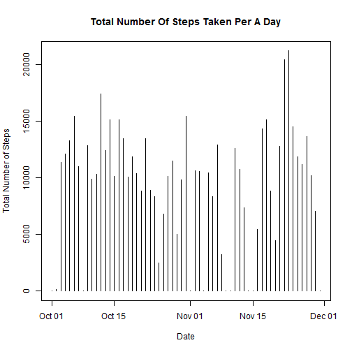
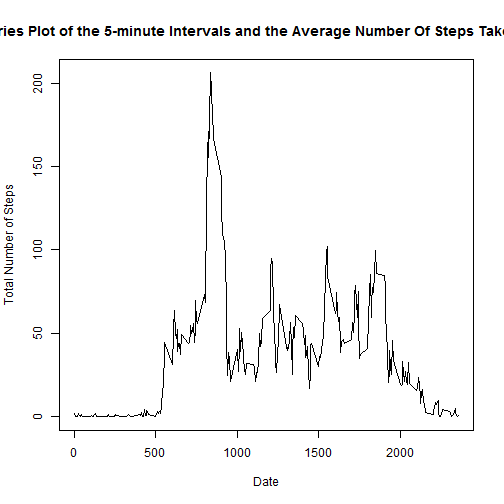
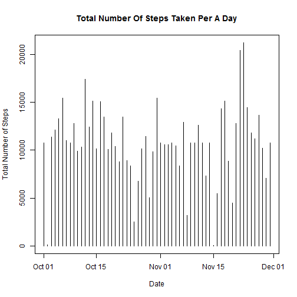

```
## 
## Attaching package: 'dplyr'
## 
## The following object is masked from 'package:stats':
## 
##     filter
## 
## The following objects are masked from 'package:base':
## 
##     intersect, setdiff, setequal, union
```

```
## Warning: package 'timeDate' was built under R version 3.1.3
```

```
## data.table 1.9.4  For help type: ?data.table
## *** NB: by=.EACHI is now explicit. See README to restore previous behaviour.
## 
## Attaching package: 'data.table'
## 
## The following objects are masked from 'package:lubridate':
## 
##     hour, mday, month, quarter, wday, week, yday, year
## 
## The following objects are masked from 'package:dplyr':
## 
##     between, last
```

## Loading and preprocessing the data


```r
activitydata <- data.table(read.csv("activity.csv", header = TRUE, na.strings = "NA"))
activitydata$date <- as.Date(activitydata$date, "%Y-%m-%d")
```

## What is mean total number of steps taken per day?
1. Here is the code to calculate the total number of steps per a day: 

```r
sumdata <- select(activitydata, date, steps)
by_date <- group_by(sumdata,date)
sumdata<- summarize (by_date, sum(steps, na.rm = TRUE))
setnames(sumdata, names(sumdata), c("Date", "Total_Steps"))
```

2. Here is the histogram graph of the total number of steps taken per day: 

```r
plot (sumdata$Date, sumdata$Total_Steps, main = "Total Number Of Steps Taken Per A Day", xlab = "Date", ylab = "Total Number of Steps", type = "h")
```

 

3. Here is the mean of the number of steps taken per a day:

```r
mean(sumdata$Total_Steps, na.rm=TRUE)
```

```
## [1] 9354.23
```

4. Here is the median of the number of steps taken per a day:

```r
median(sumdata$Total_Steps, na.rm=TRUE)
```

```
## [1] 10395
```
## What is the average daily activity pattern?
1. Here is the code to calculate the average daily activity pattern:

```r
intdata <- select (activitydata, interval, steps)
by_interval <- group_by(intdata, interval)
intdata <- summarize(by_interval, mean(steps, na.rm = TRUE))
setnames(intdata, names(intdata), c("Interval", "Avg_Steps"))
```
2. Here is the time series plot:

```r
plot (intdata$Interval, intdata$Avg_Steps, main = "Time Series Plot of the 5-minute Intervals and the Average Number Of Steps Taken Per A Day", xlab = "Date", ylab = "Total Number of Steps", type = "l")
```

 
3. Here is the code to find the 5-minute interval that contains the maximum number of steps: 

```r
xt <- filter(intdata, Avg_Steps == max(intdata$Avg_Steps))
print(xt, type="html")
```

```
## Source: local data table [1 x 2]
## 
##   Interval Avg_Steps
## 1      835  206.1698
```
## Imputing missing values
1. Here is the code to calculate and report the number of missing values in the dataset:

```r
length(is.na(activitydata))
```

```
## [1] 52704
```
2. Here is the code to fill in the missing data with averages: 

```r
avgs <- mean (activitydata$steps, na.rm = TRUE)
avgi <- mean (activitydata$interval, na.rm = TRUE)
activitydata$steps[is.na(activitydata$steps)==TRUE]<- avgs
activitydata$interval[is.na(activitydata$interval)==TRUE]<- avgi
```
3. Here is the code to calculate the total number of steps taken each day: 

```r
sumdata2 <- select(activitydata, date, steps)
by_date <- group_by(sumdata2,date)
sumdata2<- summarize (by_date, sum(steps, na.rm = TRUE))
setnames(sumdata2, names(sumdata2), c("Date", "Total_Steps"))
```
4. Here is a histogram of the total number of steps taken each day: 


```r
plot (sumdata2$Date, sumdata2$Total_Steps, main = "Total Number Of Steps Taken Per A Day", xlab = "Date", ylab = "Total Number of Steps", type = "h")
```

 

5. Here is the code to calculate the median and mean total number of steps taken per day: 


```r
at <- summary(sumdata2$Total_Steps)
print(at, type = "html")
```

```
##    Min. 1st Qu.  Median    Mean 3rd Qu.    Max. 
##      41    9819   10770   10770   12810   21190
```
## Are there differences in activity patterns between weekdays and weekends?

1. Here is a code to create a new factor variable: 

```r
activitydata1 <- mutate(activitydata, week_days = isWeekday(activitydata$date, wday=1:5))
```
2. Here is a code to create the data set for the plot:

```r
adata <- select(activitydata1, week_days, steps)
by_week_days <- group_by(adata,week_days)
```

